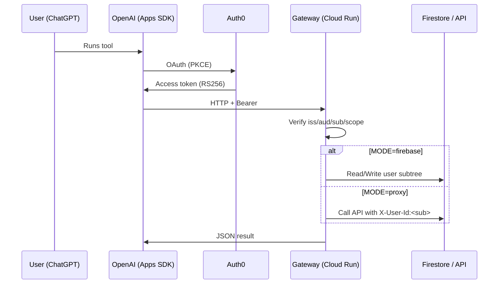

# OpenAI ↔ Auth0 OAuth Gateway (TypeScript)

Turn ChatGPT Apps SDK / MCP connectors into user-scoped, Auth0-secured calls to your backend or Firestore.  
Handles RS256 JWTs, audience checks, per-tool scopes, and optional Dynamic Client Registration (DCR) client promotion.

[](LICENSE)


**Quick links:**  
- ▶️ [Quickstart](#quickstart-10-minutes) • 🔐 [Auth0 setup](#auth0-setup-copypaste-checklist) • 🤝 [ChatGPT connector](#configure-the-chatgpt-connector-apps-sdkmcp) • 🩺 [Health & smoke tests](#health--smoke-tests) • 🛡️ [Security defaults](#security-defaults) • 🆘 [Troubleshooting](#troubleshooting-top-5)

---

## Why this exists

Apps SDK / MCP OAuth often fails due to:
- **Opaque tokens (JWE)** instead of JWTs
- Wrong **audience** / issuer
- Missing **scopes** or RBAC
- **DCR** (dynamic client) quirks and connector client enablement

This gateway:
- ✅ Verifies **RS256 JWTs** (iss/aud/sub/exp/nbf) via JWKS  
- ✅ Enforces **per-tool scope** allowlists (deny by default)  
- ✅ Exposes an **OAuth-protected resource** endpoint  
- ✅ (Optional) **Promotes** DCR clients via **Auth0 Log Stream → Webhook**  
- ✅ Ships **Cloud Run** one-command deploy, **health checks**, and **smoke tests**  
- ✅ Supports **Firestore mode** (user-scoped data) and **API proxy mode**

---

## Quickstart (10 minutes)

```bash
# 1) Clone
git clone https://github.com/davidcrowe/openai-auth0-gateway
cd openai-auth0-gateway

# 2) Create .env from example and fill values
cp examples/cloud-run/.env.example .env
$EDITOR .env

# 3) Deploy to Cloud Run (needs gcloud auth + project set)
./examples/cloud-run/deploy.sh

# 4) Health checks
curl -s https://<YOUR_GATEWAY_DOMAIN>/health
curl -s https://<YOUR_GATEWAY_DOMAIN>/health/auth0   # issuer/audience/JWKS (+ DCR webhook last-seen)

# 5) Configure ChatGPT connector (see docs/chatgpt-connector.md for screenshots)
# ...then hit the protected resource endpoint:
curl -i https://<YOUR_GATEWAY_DOMAIN>/.well-known/oauth-protected-resource
# (expect 401 without a token; 200 with a valid RS256 JWT)
```

### `.env` example

```env
# --- Auth0 (required)
AUTH0_DOMAIN=yourtenant.us.auth0.com
AUTH0_ISSUER=https://yourtenant.us.auth0.com/
AUTH0_JWKS_URI=https://yourtenant.us.auth0.com/.well-known/jwks.json
AUTH0_AUDIENCE=https://gateway.yourdomain.com/api   # Create this API in Auth0 (RS256 + RBAC)

# --- Optional: DCR client promotion (Management API creds + webhook)
MGMT_DOMAIN=yourtenant.us.auth0.com
MGMT_CLIENT_ID=xxxxxxxx
MGMT_CLIENT_SECRET=xxxxxxxx
LOG_WEBHOOK_SECRET=super-long-random-secret

# --- Backend mode (choose one)
MODE=firebase                          # or "proxy"

# Firestore mode
GOOGLE_PROJECT_ID=my-gcp-project
GOOGLE_APPLICATION_CREDENTIALS=/var/secrets/google/key.json
APP_NAME=inner

# Proxy mode
PROXY_BASE_URL=https://api.myapp.com
PROXY_AUTH_HEADER=X-Service-Token
PROXY_AUTH_VALUE=xyz-service-token

# --- Gateway
RATE_LIMIT_PER_MIN=60
LOG_LEVEL=info
PORT=8080
```

> **Note:** Replace every `<YOUR_GATEWAY_DOMAIN>` with your Cloud Run URL (or mapped custom domain).

---

## Auth0 setup (copypaste checklist)

1. **Create API** in Auth0  
   - Identifier = `https://gateway.yourdomain.com/api`  
   - Signing algorithm = **RS256**  
   - Enable **RBAC** and **Add Permissions in the Access Token**

2. **Create M2M app** *(only if using DCR promotion)*  
   - Grant scopes: `read:clients update:clients read:connections update:connections read:logs`

3. **Allow DCR** *(Tenant Settings)* if your connector will register clients dynamically

4. **Log Stream → Webhook** *(for DCR promotion)*  
   - URL = `https://<YOUR_GATEWAY_DOMAIN>/auth0/logs`  
   - Header `X-Webhook-Secret: <LOG_WEBHOOK_SECRET>`

5. **Enable connections** you expect users to log in with

6. **Create API permissions** matching your tools (e.g., `messages:read`, `messages:write`)

➡ **Self-check:** `https://<YOUR_GATEWAY_DOMAIN>/health/auth0` should show issuer/audience OK, JWKS reachable, and webhook last-seen (if configured).

---

## Configure the ChatGPT connector (Apps SDK / MCP)

- **Auth type:** OAuth 2.0 (PKCE)  
- **Authorization URL:** `https://<AUTH0_DOMAIN>/authorize`  
- **Token URL:** `https://<AUTH0_DOMAIN>/oauth/token`  
- **Client type:** Public (no client secret)  
- **Scopes:** `openid profile email offline_access messages:read messages:write`  
- **Redirect URIs:** copy from ChatGPT UI → paste into Auth0 **Allowed Callback URLs**

**First run:** ChatGPT opens Auth0. After login/consent, tool calls include a Bearer token; the gateway verifies it and enforces scopes.

---

## Modes

### A) Firestore mode (no-code if user-scoped)
- Data convention: `apps/<APP_NAME>/users/<sub>/...`
- Endpoints:
  - `GET /v1/user/me` → `{ sub, email? }`
  - `GET /v1/data/:collection` → list docs within user subtree
  - `POST /v1/data/:collection` → insert doc (schema-checked)

### B) API proxy mode
- Rewrites requests to `PROXY_BASE_URL`, injecting `X-User-Id: <sub>` and/or `?userId=<sub>`
- Post-filters responses to enforce isolation (defense-in-depth)

---

## Health & smoke tests

```bash
# Overall
curl -s https://<YOUR_GATEWAY_DOMAIN>/health

# Auth sanity (issuer/audience/JWKS; and DCR webhook last-seen if configured)
curl -s https://<YOUR_GATEWAY_DOMAIN>/health/auth0

# Protected resource (authz check)
curl -i https://<YOUR_GATEWAY_DOMAIN>/.well-known/oauth-protected-resource
curl -H "Authorization: Bearer <ACCESS_TOKEN>" https://<YOUR_GATEWAY_DOMAIN>/.well-known/oauth-protected-resource
```

---

## Security defaults

- RS256 **JWTs only**; opaque/JWE access tokens are rejected with `ACCESS_TOKEN_IS_ENCRYPTED_JWE`  
- Strict **audience** and **issuer** checks  
- Per-tool **scope allowlist** (deny by default)  
- Rate limit per `sub` (default **60 req/min**)  
- Logs redact headers/body by default (configurable)  
- JWKS cached with rotation

---

## Troubleshooting (top 5)

- **Opaque token** → Enable RS256 for your API; turn on “Add permissions in access token”  
- **Audience mismatch** → `access_token.aud` must equal `AUTH0_AUDIENCE`  
- **insufficient_scope** → Add the permission to your API; re-consent in ChatGPT  
- **DCR promotion didn’t run** → Check Log Stream webhook hits + secret; verify M2M scopes  
- **401 after success** → Token expired; re-authorize in ChatGPT

➡ See: [`docs/troubleshooting.md`](docs/troubleshooting.md)

---

## Architecture



---

## Roadmap

- Okta adapter  
- Org/tenant path via `org_id` claim  
- Admin UI for logs, rate limits, policy  
- Multi-LLM adapters (Gemini / Claude)  
- Self-host Helm chart

**License:** MIT • PRs welcome